 

<h2>Follow and discover new tattoo artists near you and connect with other enthusiasts!</h2>

<h1 id="contents">Table of Contents</h1>

-   [Introduction](#introduction)
-   [Live Site](#demo)
    -   [Backend API repository](#demo)
-   [User Experience - UX](#user-experience)
    -   [User Stories](#user-stories)
    -   [Agile Methodology](#agile-methodology)
    -   [The Scope](#the-scope)
-   [Design](#design)
    -   [Colours](#colours)
    -   [Typography](#typography)
    -   [Media](#media)
    -   [Wireframes](#wireframes)
-   [Features](#features)
    -   [Homepage](#homepage)
    -   [Navigation Desktop](#navigation-desktop)
    -   [Navigation Mobile](#navigation-mobile)
    -   [Create A Post](#create-a-post)
    -   [Edit/Delete A Post](#post-edit-delete)
    -   [Comment Creation](#comment-creation)
    -   [Edit/Delete A Comment](#comment-edit-delete)
    -   [Feed Page](#feed)
    -   [Saved Page](#saved)
    -   [User Profile](#profile)
    -   [Future Features](#future-features)
-   [Technologies](#technologies)
    -   [Languages](#languages)
    -   [React Packages](#react-packages)
    -   [Frameworks & Libraries](#frameworks)
-   [Development](#development)
    -   [Custom Components](#custom-components)
    -   [Contexts](#custom-contexts)
-   [Testing](TESTING.md)
    -   [Automated Jest Testing Results](#testing-results)
    -   [Manual Testing Results](#testing-results)
    -   [Bugs](TESTING.md#bugs)
-   [Deployment](#deployment)
-   [Credits](#credits)

<h1 id="introduction">Introduction</h1>

This is the front-end repository for my fifth and final portfolio project throughout my time in the Code Institute Full-stack Softwarer Development programme. tatted. is a frontend React.js application built for tattoo artists and enthusiasts to showcase their work, follow others and inspire each other.

This app allows tattoo artists to post their work for visibility in the community. Tattoo enthusiasts as well as artists enjoy the functionality of liking/saving posts, following others as well as commenting in order to connect with others on the platform.

<h1 id="demo">Live Site</h1>

A live version of the application can be found <a href="https://tatted.herokuapp.com/" target="_blank">HERE</a> 

This is the front-end repository of the application however you can view the backend REST API repository <a href="https://github.com/ryanoneill416/tatted_api" target="_blank">HERE </a>  

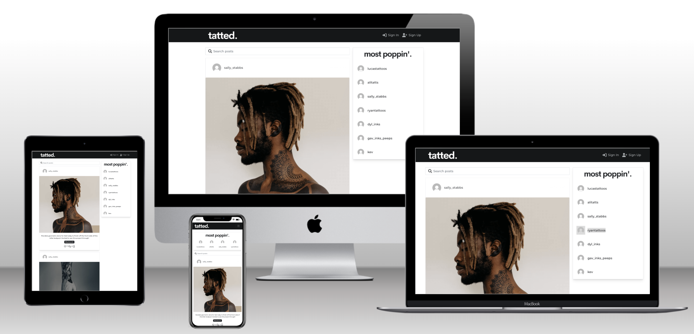
<a href="#top">Back to the top</a>
  

<h1 id="user-experience">User Experience - UX</h1>

<h2 id="user-stories">User Stories</h2>

As an unauthenticated website user, I can:

- Navigate around the application intuitively to view all desired content.
- View all posts posted by the tattoo artists on the platform.
- Search using the searchbar for posts by description, username or style.
- View the post detail page of each page, here the user can view the likes and comments relating to the post.
- Register for an account on the platform, being able to choose if I am a tattoo artist or not.

As an authenticated user who is not a tattoo artist, I can:

- Like/unlike, comment and save posts on the platform.
- Follow/unfollow other users.
- Have my own feed page showing all of the posts posted by the tattoo artists in which I follow.
- Have my own saved page serving as a place to keep all posts I have saved.
- Edit/Delete the comments that I post.
- Have my own profile page.
- Edit my profile information such as profile image and bio.
- Edit my username.
- Update my own password.

As an authenticated user who is a tattoo artist, I can:

- Have access to all of the same privilidges of non artists.
- I can post my work on the platform, posting with an image, description and style declaration.
- I can edit the posts that I have created.
- I can delete the posts that I have created.
- I can be featured in the 'Most Poppin' artists component if I qualify as a most followed artist.

<h2 id="agile-methodology">Agile Methodology</h2>

The Agile Methodology was used to plan this project. This was implemented through Github and the kanban project board.

Through the use of the Kanban board in the projects view in Github, the project was divived into a few different sections:

-   Todo
-   In Progress
-   Done

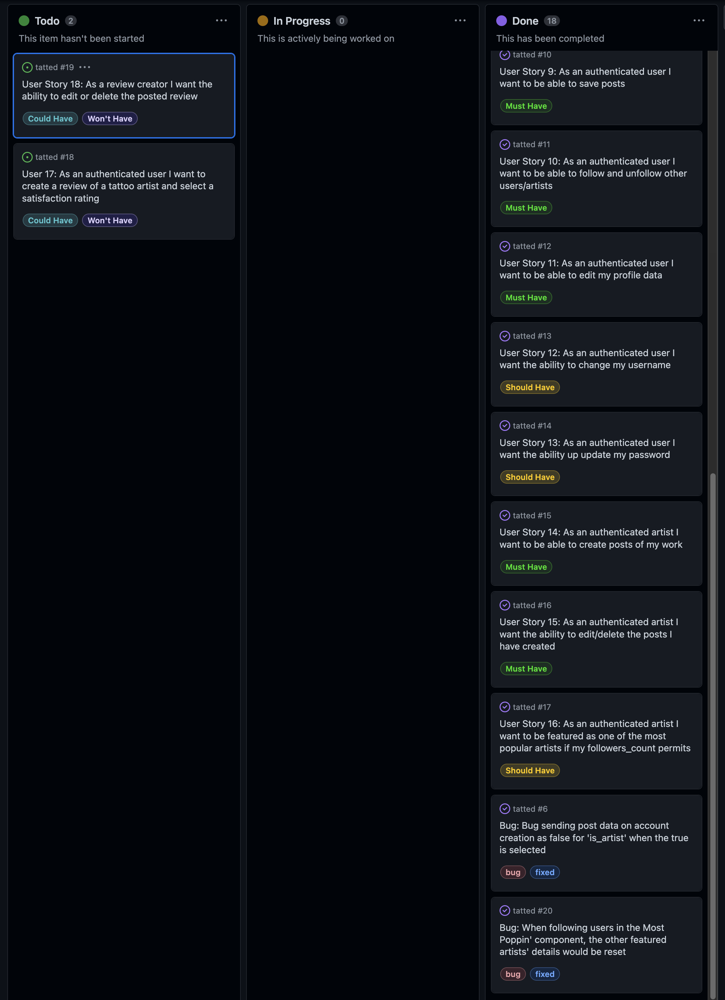

Github issues were used to create User Stories and any other fixes or updates for the project. This was where the project user was assigned, labels were added to provide clarity, and the story was added to the appropriate sprint and the project. Each User Story, Fix or Update had a clear title.

The implementation of the tattoo artist reviews feature, while being fully functional in the REST API, was not possible to be implemented in the front-end in time for submission and has been marked accordinly as [Future Features](#future-features) for further development of the application.

The Github issues were not just used to record User Stories but also used to record any bug fixes or updates to the codebase as well.

<h2 id="the-scope">The Vision</h2>

-   To provide users with a simplistic, appealing and intuitive experience when using the platform.
-   To provide a platform with a clear vision and purpose.
-   To provide role-based permissions determining what can be done on the platform e.g. only tattoo artists can post their work.
-   To provide search functionality to find tattoos by artist's username, the description or the style specified upon post creation.

<a href="#top">Back to the top</a>

<h1 id="design">Design</h1>

<h2 id="colours">Colours</h2>

A monochromatic and simplistic approach was used in development of this frontend application. This was to ensure the content posted on the platform will be the focus.

-   Navbar / dark grey accents: #212427

-   Purple accents: #b57dff

-   Main background: #f8f8f8

-   Content background: #ffffff

<h2 id="typography">Typography</h2>

The Montserrat google font was used solely throughout this application to ensure consistency and simplicity, whilst also looking sleek and modern.

<h2 id="media">Media</h2>

-   All images are from<a href="https://unsplash.com/" target="_blank"> Unsplash </a> and <a href="https://www.pexels.com/" target="_blank">Pexels</a>

-   The tatted. logo was designed by myself using<a href="https://www.figma.com/" target="_blank"> Figma </a>

<a href="#top">Back to the top</a>

The wireframes were created using <a href="https://whimsical.com/">Whimsical</a>

-  Desktop

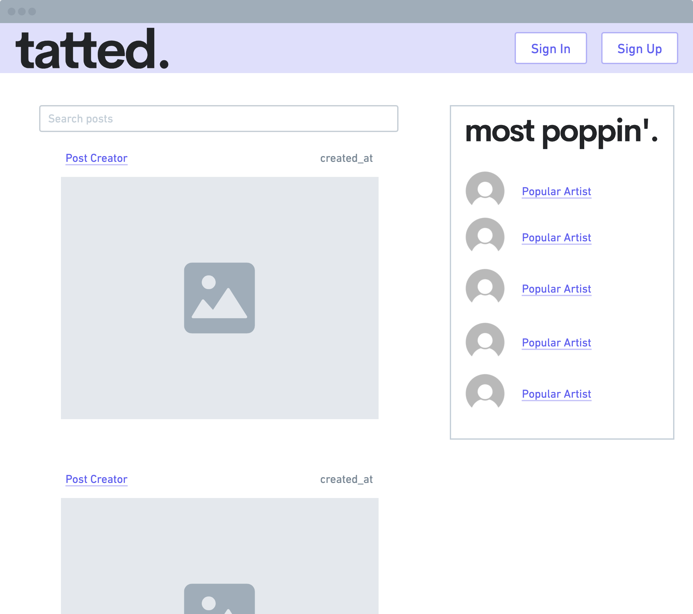

-   Mobile

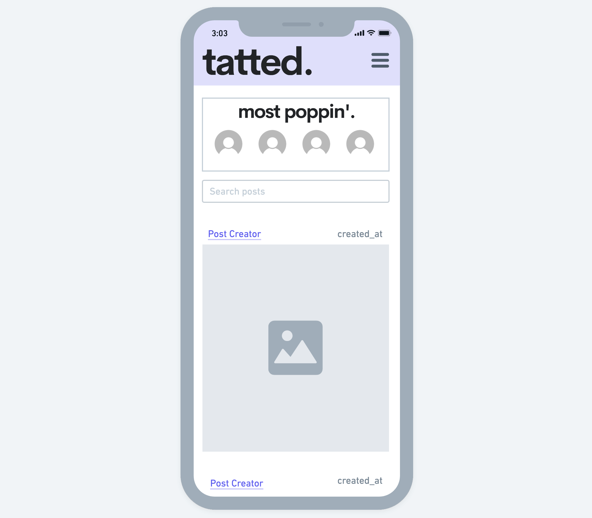

<h1 id="features">Features</h1>

<h2 id="homepage">Home Page</h2>

- The Home Page is the first instance of the user and application interaction.
- It is designed to guide the user around the platform with ease of simplicity.
- The home page displays all posts created by tattoo artists showing the most recently posted first.
- The PoppingArtists component outlines to the user the most popular artists on the platform.

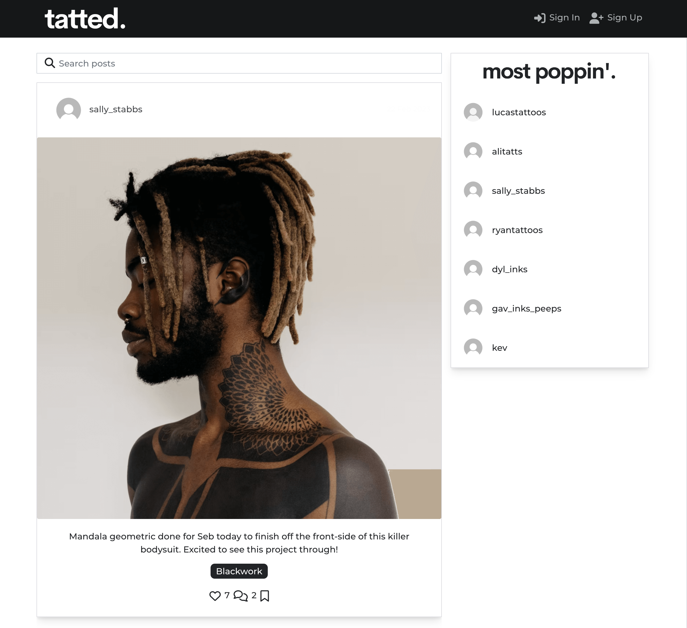

<a href="#top">Back to the top</a>

<h2 id="navigation-desktop">Navigation Desktop</h2>

-   The site navigation is done through the use of a high-contrasting navigation bar at the top of every platform instance.

-   The navbar is positioned as stuck to the top of the screen to ensure easy access.

-   The navigation links available to users differ depending on if the user is logged in and if the logged in user is an artist.

-   When a user is authenticated but not an artist and logged in they have access to the 'Feed', 'Saved', 'Profile' and 'Sign Out' links.

    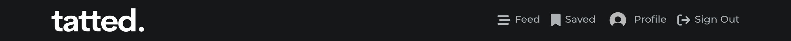

-   When a user has opened an account as a tattoo artist then they additional see the

    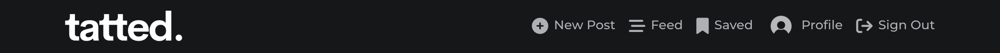

<h2 id="navigation-mobile">Navigation Mobile</h2>

-   On mobile, the navigation menu lives within a responsive burger menu that appears upon being selected and transitions away when clicked away from.

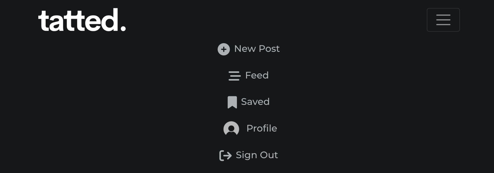

<a href="#top">Back to the top</a>

<h2 id="create-a-post">Creating A Post</h2>

-   When an authenticated user who is an artist is logged in they can create a post by selecting the 'New Post' button.

-   This redirects the artist to the PostCreateForm component to create a post with the image, style and content fields.

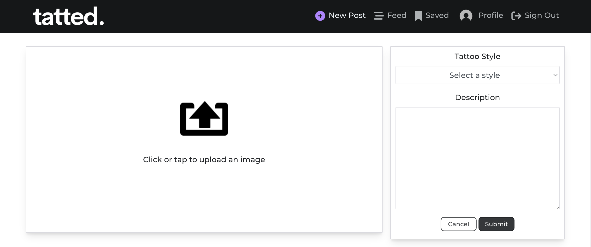

<h2 id="post-edit-delete">Edit/Delete A Post</h2>

-   When the PostDetailPage is accessed of a specific post, if the user is logged in and they are owner of the post, they will be prompted with the dropdown below:

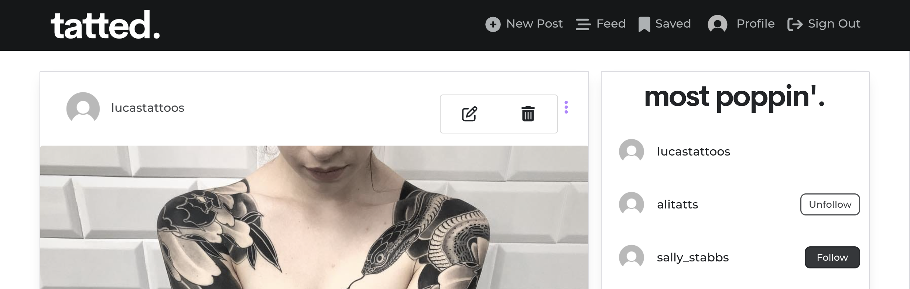

-   If the edit button is selected the user will be brought to the PostEditForm component to allow for changing of any of the post fields.
-   If the delete button is selected the user's post will be deleted from the database accordingly.

<a href="#top">Back to the top</a>

<h2 id="comment-creation">Comment Creation</h2>

-   When the PostDetailPage is accessed of a specific post, any authenticated user can leave a comment using the CommentCreateForm which is rendered above existing comments, if any.

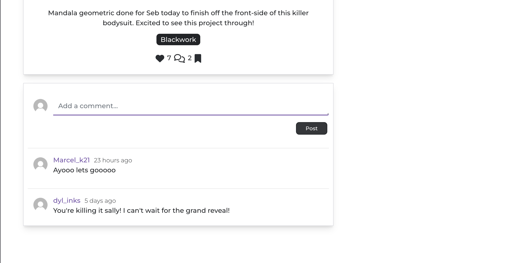

<h2 id="comment-edit-delete">Edit/Delete A Comment</h2>

-   When the PostDetailPage is accessed of a specific post, if the user is logged in and they are owner of the comment, they will be prompted with the same dropdown used in post editing/deletion
-   Similarly, when the edit option is selected, the text field will be open to being updated and if the delete option is selected the comment will be deleted from the database.

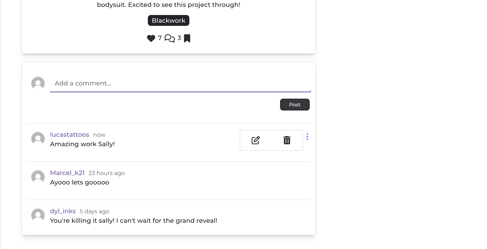

<a href="#top">Back to the top</a>

<h2 id="feed">Feed Page</h2>

-   When a user is logged in and the user selects the 'Feed' navlink, only the posts of artists the user follows will show.
-   If no artists are followed by the user, then the following no results placeholder will be shown.

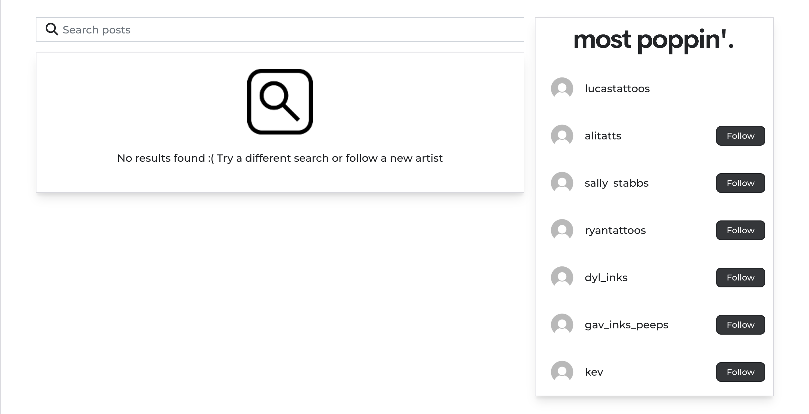

<a href="#top">Back to the top</a>

<h2 id="saved">Saved Page</h2>

-   When a user is logged in and the user selects the 'Saved' navlink, only the posts in which the logged in user has saved will be shown.

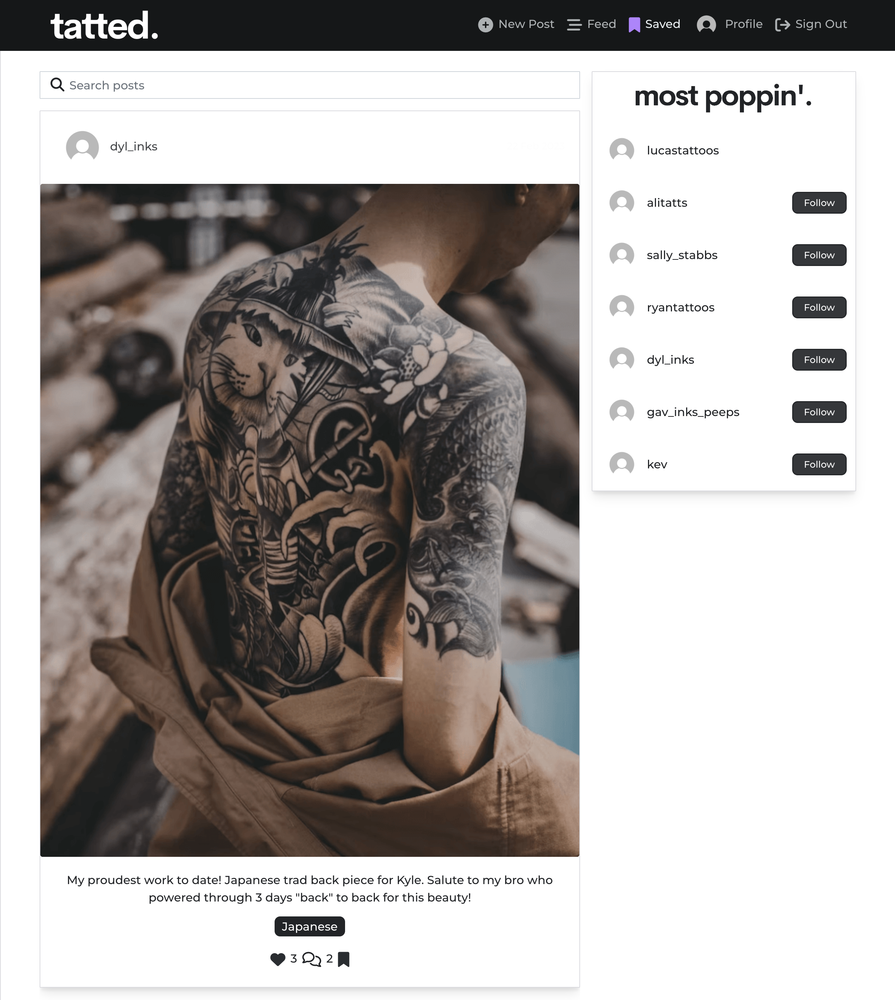

<a href="#top">Back to the top</a>

<h2 id="profile">User Profile</h2>

-   The user profile page displays all specific profile information of a user including their username, profile image, bio as well as their post count, following count and followers count.
-   Authenticated users have the option to follow or unfollow a user as long as they are not on their own profile page.
-   When an authenticated user is viewing their own profile page they will have the option to update their profile information, change their username as well as updating their password.
-   This is done through the profile dropdown menu toggle, seen below.

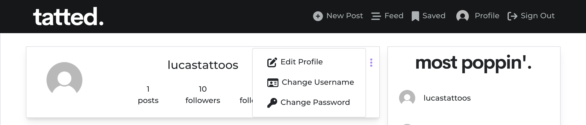

-  The following forms are shown which allow the user to make any updates to this information as they please.

- ProfileEditForm
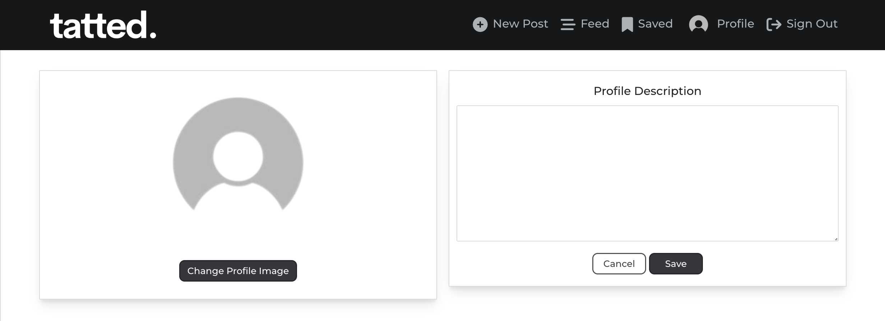

- UsernameForm
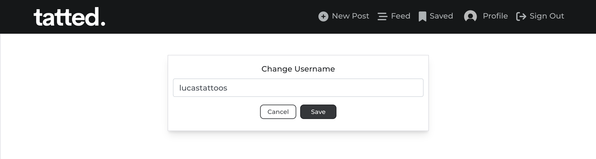

- PasswordForm
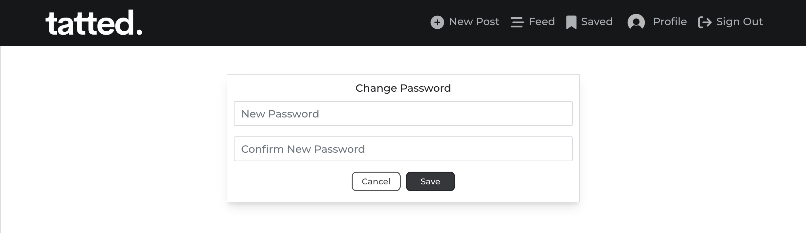

<a href="#top">Back to the top</a>

<h2 id="future-features">Future Features</h2>

1. The implementation of the Review model:

- The functionality for users to post reviews of a tattoo artist on the platform with the fields of content and a satisfaction rating has been built successfully within the REST API in the backend.
- Unfortunately due to time constraints the implementation of this in the frontend will be done after grading of the project as then there will be time for the implementation.

2. Explore Page:

- Instead of the home page I would like to create an explore page for users which will be the default home page for unauthenticated users.
- Posts will be displayed in a grid as so there is greater visibility of what content lies on the platform for viewing, rather than singular scrolling on a broad scale.

3. Booking functionality:

- I am interested in implementing a system where users can request a booking with a tattoo artist of their choice.
- Users would then have a section within their profile to view their upcoming bookings.
- This potentially could ensure that reviews are created solely by verified clients using a unique reference upon booking.

<a href="#top">Back to the top</a>

<h1 id="technologies">Technologies</h1>

<h2 id="languages">Languages Used</h2>

-   [HTML 5](https://en.wikipedia.org/wiki/HTML/)
-   [CSS 3](https://en.wikipedia.org/wiki/CSS)
-   [JavaScript](https://www.javascript.com/)
-   [React](https://reactjs.org/)

<h2 id="react-packages">React Dependencies Used</h2>

-   [NPM](https://www.npmjs.com/package/node) 
    Package manager used to install dependencies.
-   [React Bootstrap](https://react-bootstrap.github.io/) 
    Was used to style the website, add responsiveness and interactivity.
-   [Axios](https://axios-http.com/docs/intro) 
    As the HTTP client for the app.
-   [JWT Decode](https://www.npmjs.com/package/jwt-decode) 
    To help decoding JWTs token which are Base64Url encoded.
-   [react-infinite-scroll-component](https://www.npmjs.com/package/react-infinite-scroll-component) 
    A component to make the post load as an infinite scroll.
-   [react-router-dom](https://www.npmjs.com/package/react-router-dom) 
    Bindings for using React Router in web applications.
-   [ESLint](https://eslint.org/) 
    ESLint was used to evaluate all the React.js code.

<h2 id="frameworks">Frameworks - Libraries - Programs Used</h2>

-   [ElephantSQL](https://www.elephantsql.com/) 
    ElephantSQL is a PostgreSQL database hosting service were the database for foodSNAP was created
-   [Git](https://git-scm.com/) 
    Git was used for version control by utilizing the Gitpod terminal to commit to Git and push to GitHub
-   [GitHub](https://github.com/) 
    GitHub is used to store the project's code after being pushed from Git
-   [Heroku](https://id.heroku.com) 
    Heroku was used to deploy the live project
-   [Whimsical](https://whimsical.com/) 
    Whimsical was used to create the wireframes & flow chart
-   [W3C - HTML](https://validator.w3.org/) 
    W3C- HTML was used to validate all the HTML code
-   [W3C - CSS](https://jigsaw.w3.org/css-validator/) 
    W3C - CSS was used to validate the CSS code
-   [Fontawesome](https://fontawesome.com/) 
    To add icons to the app
-   [Google Chrome Dev Tools](https://developer.chrome.com/docs/devtools/) 
    To check App responsiveness and debugging
-   [Figma](https://www.figma.com/) 
    To build the logo and icon for the project
-   [Google Fonts](https://fonts.google.com/) 
    To utilise the Montserrat font throughout the project

<a href="#top">Back to the top</a>

<h1 id="development">Development</h1>

<h2 id="custom-components">Custom Components</h2>

-   [Asset.js](https://github.com/ryanoneill416/tatted/blob/main/src/components/Asset.js) was created to display a spinner when data is being fetched to notify the user that an action is being performed.
-   [Avatar.js](https://github.com/ryanoneill416/tatted/blob/main/src/components/Avatar.js) was created to display the users profile image throughout the app.
-   [DropdownOptions](https://github.com/ryanoneill416/tatted/blob/main/src/components/DropdownOptions.js) was created to display options to the user in a responsive way, such as the option to either edit or delete a post.
-   [NavBar.js](https://github.com/ryanoneill416/tatted/blob/main/src/components/DropdownOptions.js) was created to display the navigation menu and display different options to the user depending on both if they are authenticated an if is_artist=True for that user instance.
-   [NotFound.js](https://github.com/ryanoneill416/tatted/blob/main/src/components/NotFound.js) as created to display a message to the user if the content they are looking for does not exist.

<h2 id="custom-contexts">Custom Context</h2>

-   [CurrentUserContext.js](https://github.com/ryanoneill416/tatted/blob/main/src/contexts/CurrentUserContext.js) was created to get the current users authentication state, check if the user is an artist and also to redirect the user to the signin page if not signed in.

-   [ProfileDataContext.js](https://github.com/ryanoneill416/tatted/blob/main/src/contexts/ProfileDataContext.js) was created to setProfileData, handleFollow, handleUnfollow of user profiles and access this data throughout the app.

<a href="#top">Back to the top</a>

<h1 id="testing">Testing</h1>

<h2 id="testing-results">Automated Testing Results</h2>

-   Automated Jest Testing results can be seen [HERE](TESTING.md#automated-testing)

<h2 id="testing-results">Manual Testing Results</h2>

-   Manual Testing results can be seen [HERE](TESTING.md#manual-testing)

<h1 id="deployment">Deployment</h1>

<a href="#top">Back to the top.</a>

### This project was created using a GitHub repostiory and the Gitpod browser-based text editor:

<ol>
    <li>A new repository was created without a template</li>
    <li>The 'tatted' name was given to my new repository and I selected 'Create Repository'</li>
    <li>I went to the repository itself on Github and clicked the 'Gitpod' button to build the GitPod workspace which would allow me to build and edit the code used to make the 'tatted.' application.</li>
    <li>Version control was used throughout the project using the following commands in the terminal using Bash
        <ul>
            <li>git add . <strong>OR</strong> git add "file name" - to stage the changes and get them ready for being committed to the local repo.</li> 
            <li>git commit -m "Description of the update" - to save the change and commit the change to the local repo</li>
            <li>git push - to push all committed changes to the GitHub</li>
        </ul>
    </li>
</ol>

## Heroku

The project was deployed via <a href="https://id.heroku.com/login" target="_blank">Heroku</a>, and the live link can be found here: <a href="https://tatted.herokuapp.com/" target="_blank">tatted.</a>

Some of the deployment steps below are specifically required for this project and may not be applicable to older versions, or different projects.

Before deploying to Heroku I created the Procfile with web: serve -s build

Created .slugignore with /documentation, README.md & TESTING.md as paths to ignore in Heroku as I don't want the documentation to upload to Heroku.

This project was deployed to Heroku using the following steps:

-   Creating A Heroku App
    To start you will need to login to Heroku or create your account, the first thing is to create a new app. Heroku creates a
    URL based on your app name, so it must be unique not only on your account, but
    across the whole site.

-   Next you will head to the settings tab where you can input any necessary Config Vars. For this application for example this was where I housed my database url, cloud storage url, allowed hosts and more. Now you can go to the deploy tab and connect your heroku app to the github repository where you code is stored.

-   When you push code to Heroku it will look at the repository contents to decide how
    to build the project. One of the factors taken into consideration is the package file.
    With a React project the standard file is a package.json file, which will have the
    list of packages needed to run the project. If this file is present it will build the project
    using the React buildpack.

## Deployment Steps On Heroku.

-   In Heroku create a new app, give it a name and choose location.

-   In the deploy tab, go to 'deployment method', choose 'Github'

-   Search for the repository in Github that you want to connect and click on the connect button

-   In the 'manual deploy' section click on 'deploy branch'

-   The build log will run, when complete you will see a message saying 'build succeeded'

-   An 'Open App' button will appear, click this to take you to your deployed app.

-   You can enable automatic deploys in the 'deployment section' so each time you push your code to 'Github' your deployed app will be updated.

### Forking the GitHub repo

If you want to make changes to the repo without affecting it, you can make a copy of it by 'Forking' it. This will make sure that the original repo remains unchanged.

<ol>
    <li>Log in to your GitHub account</li>
    <li>Navigate to the repository <a href="https://github.com/ryanoneill416/tatted" target="_blank"><strong>here</strong></a></li>
    <li>Select the 'Fork' button in the top right corner of the page (under your account image)</li>
    <li>The repo has now been copied into your own repos and you can work on it in your chosen IDE</li>
    <li>If you have any suggestions to make regards to the code to make the site better, you can put in a pull request</li>
</ol>

### Cloning the repo with GitPod

<ol>
    <li>Log in to your GitHub account</li>
    <li>Navigate to the Repository <a href="https://github.com/ryanoneill416/tatted" target="_blank"><strong>here</strong></a></li>
    <li>Select the 'Code' button above the file list on the right had side</li>
    <li>Ensure HTTPS is selected and click the clipboard on the right of the URL to copy it</li>
    <li>Open a new workspace in GitPod</li>
    <li>In the bash terminal type 'git clone [copy url here from step 4]'</li>
    <li>Press enter - the IDE will clone and download the repo</li>
</ol>

### Github Desktop

<ol>
    <li>Log in to your GitHub account</li>
    <li>Navigate to the Repository <a href="https://github.com/ryanoneill416/tatted" target="_blank"><strong>here</strong></a></li>
    <li>Select the 'Code' button above the file list on the right had side</li>
    <li>Select 'Open with GitHub Desktop'</li>
    <li>If you haven't already installed GitHub desktop application - you will need to follow the relevant steps to do this</li>
    <li>The repo will then be copied locally onto your machine</li>
</ol>

### Download and extract the zip directly from GitHub

<ol>
    <li>Log in to your GitHub account</li>
    <li>Navigate to the Repository <a href="https://github.com/ryanoneill416/tatted" target="_blank"><strong>here</strong></a></li>
    <li>Select the 'Code' button above the file list on the right had side</li>
    <li>Select 'Download Zip'</li>
    <li>Once you have the Zip downloaded, open it with your prefered file decompression software</li>
    <li>You can then drag and drop the files from the folder into your chosen IDE or view/edit them on your local machine</li>
    <li>If you want to create a web-app from the repo please follow the instructions in "Project Deployment"</li>
</ol>

<a href="#top">Back to the top.</a>

<h1 id="credits">Credits</h1>

-   Code Institute "Moments" tutorial helped me setup the initial setup of the tatted application.
-   Advice from other members of the course on Slack as well as other Code Institute alumni.
-   Ideas were run by my mentor Adegbenga to ensure I was focused on the project requirements specifically, as I always have more ideas that are sometimes out of scope especially within the short turnaround.
