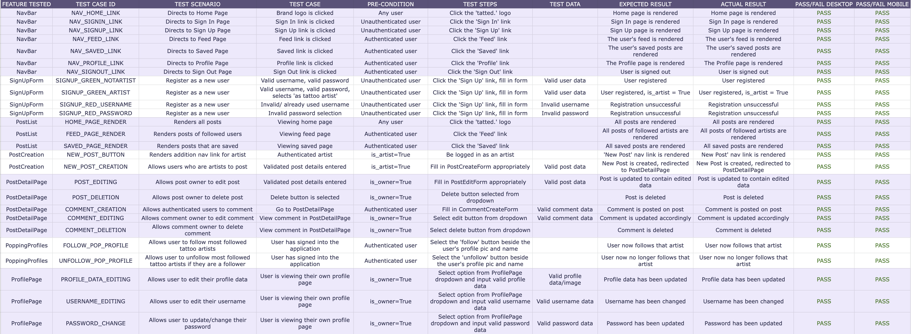
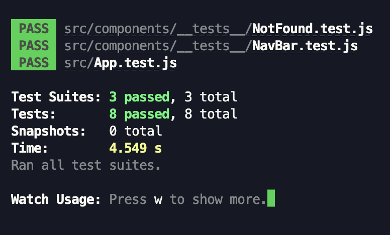
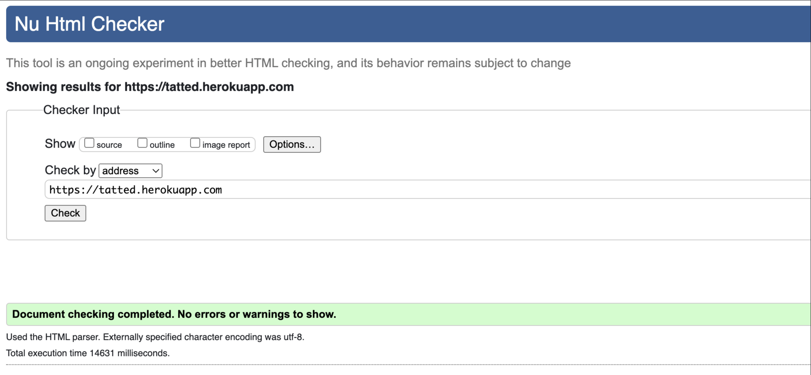
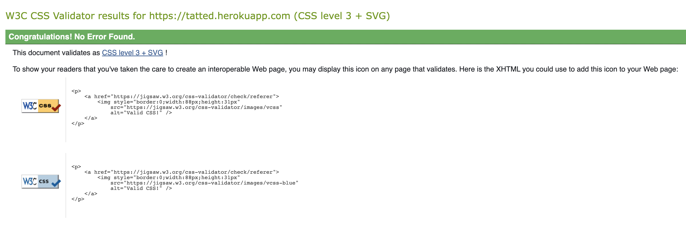
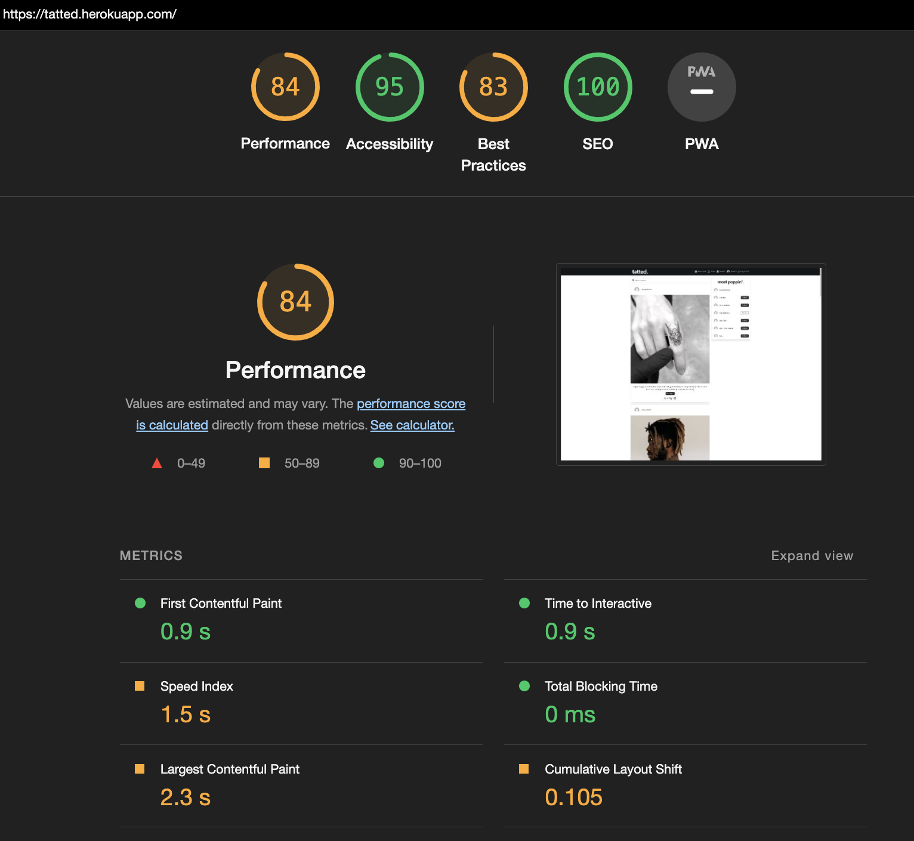
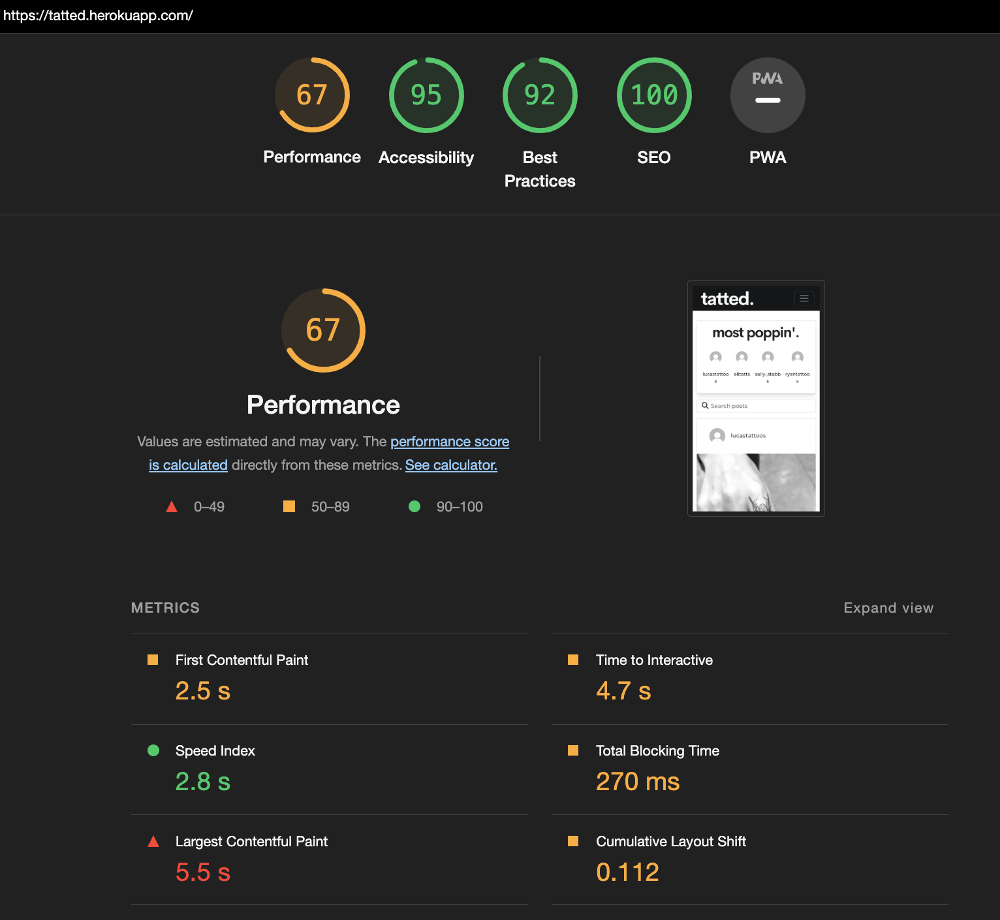

<h1 id="contents">Front-end testing</h1>

Back to the [README](README.md)

<h1 id="contents">Contents</h1>

-   [Introduction](#introduction)
-   [Manual Functional Testing](#manual-testing)
-   [Automated Jest Testing](#automated-testing)
-   [ESlint Validator](#eslint-validation)
-   [HTML Validator](#html-validation)
-   [CSS Validator](#css-validation)
-   [Lighthouse Results](#lighthouse)
    -   [Desktop](#lighthouse-desktop)
    -   [Mobile](#lighthouse-mobile)
-   [Bugs / Issues](#bugs)

<h1 id="introduction">Introduction</h1>

Testing has taken place continuously and persistently throughout the entire development lifecycle of the 'tatted.' application. The appplication was deployed to Heroku from the very start to confirm the local and remote environment was always functioning as intended.

<h1 id="manual-testing">Manual Functional Testing Results</h1>



<br/>

<h1 id="automated-testing">Automated Jest Testing Results</h1>

Jest testing of the react application was setup for testing by adding the below code to the setupTests.js file to utilise the mocks/handlers.js file in order to simulate a user logging in and out.
It also ensures set up and closing of the test environment after each instance.
The handlers.js file creates a user instance and accesses the base url and dj-rest-auth/logout/ to test user authentication.

```
import "@testing-library/jest-dom";
import { setupServer } from "msw/node";
import { handlers } from "./mocks/handlers";

const server = setupServer(...handlers);

beforeAll(() => server.listen());
afterEach(() => server.resetHandlers());
afterAll(() => server.close());
```

7 automated tests were created using Jest testing suites:

-   [NavBar.test.js](https://github.com/ryanoneill416/tatted/blob/main/src/components/__tests__/NavBar.test.js) 6 NavBar tests to see if the correct navigation links are shown to the user based on their status, logged in/logged out/logged in as a tattoo artist.

```
test("renders NavBar", () => {
  render(
    <Router>
      <NavBar />
    </Router>
  );

  const signInLink = screen.getByRole("link", { name: "Sign In" });
  expect(signInLink).toBeInTheDocument();
});

test("renders link to user profile for authenticated user", async () => {
  render(
    <Router>
      <CurrentUserProvider>
        <NavBar />
      </CurrentUserProvider>
    </Router>
  );

  const profileAvatar = await screen.findByText("Profile");
  expect(profileAvatar).toBeInTheDocument();
});

test("renders link to add new post for authenticated users who are artists", async () => {
  render(
    <Router>
      <CurrentUserProvider>
        <NavBar />
      </CurrentUserProvider>
    </Router>
  );

  const newPost = await screen.findByText("New Post");
  expect(newPost).toBeInTheDocument();
});

test("renders link to a user's feed if authenticated", async () => {
  render(
    <Router>
      <CurrentUserProvider>
        <NavBar />
      </CurrentUserProvider>
    </Router>
  );

  const feedList = await screen.findByText("Feed");
  expect(feedList).toBeInTheDocument();
});

test("renders link to a user's saved posts if authenticated", async () => {
  render(
    <Router>
      <CurrentUserProvider>
        <NavBar />
      </CurrentUserProvider>
    </Router>
  );

  const savedList = await screen.findByText("Saved");
  expect(savedList).toBeInTheDocument();
});

test("renders signin and signup again after signing out", async () => {
  render(
    <Router>
      <CurrentUserProvider>
        <NavBar />
      </CurrentUserProvider>
    </Router>
  );

  const signOutLink = await screen.findByRole("link", { name: "Sign Out" });
  fireEvent.click(signOutLink);
  const signInLink = await screen.findByRole("link", { name: "Sign In" });
  expect(signInLink).toBeInTheDocument();
  const signUpLink = await screen.findByRole("link", { name: "Sign Up" });
  expect(signUpLink).toBeInTheDocument();
});

```

-   [NotFound.test.js](https://github.com/ryanoneill416/tatted/blob/main/src/components/__tests__/NotFound.test.js) 1 test was written to test the error404 page for pages not found is rendering and showing the correct information to the user.

```
test("renders error 404 message", async () => {
  render(
    <Router>
      <NotFound />
    </Router>
  );

  const error404Message = await screen.findByText("ERROR 404:", { exact: false });
  await waitFor(() => {
    expect(error404Message).toBeInTheDocument();
  });
});
```

-   All automated tests resulted in a pass:



<a href="#top">Back to the top</a>

<h1 id="eslint-validation">ESLint Validation</h1>

All validation fixes recommended by ESLint were addressed to comply with ESLint standards accordingly.

<h1 id="html-validation">HTML Validation</h1>



<h1 id="css-validation">CSS Validation</h1>



<h1 id="lighthouse">Lighthouse</h1>

Lighthouse was used to test Performance, Best Practices, Accessibility and SEO on Desktop and Mobile.

<h2 id="lighthouse-desktop">Desktop</h2>

-   Performance could be improved on by future implementation of CDN cacheing and lazy loading images.



<h2 id="lighthouse-mobile">Mobile</h2>



<h1 id="bugs">Bugs / Issues</h1>

BUG: unsuccessful selectio of 'Join as a tattoo artist' upon user registration:

- This project was my first time creating a customer user authentication model allowing there to be two types of users on the platform, artists and enthusiasts.
- There was an bug encountered that when the checkbox was selected upon registration, it would still register the account with is_artist = false which was a problem.
- This issue was only prevalent on the frontend as in the REST API user creation was working as intended.
- To solve this issue I created a custom save feature in the API which you can see the code below:

```
class CustomRegisterSerializer(RegisterSerializer):

    username = serializers.CharField(required=True)
    password1 = serializers.CharField(write_only=True)
    password2 = serializers.CharField(write_only=True)
    is_artist = serializers.BooleanField(required=True)

    def get_cleaned_data(self):
        super(CustomRegisterSerializer, self).get_cleaned_data()
        return {
            'username': self.validated_data.get('username', ''),
            'password1': self.validated_data.get('password1', ''),
            'password2': self.validated_data.get('password2', ''),
            'is_artist': self.validated_data.get('is_artist', '')
        }

    def custom_signup(self, request, user):
        cleaned_data = self.get_cleaned_data()

        user.is_artist = cleaned_data['is_artist']

        user.save()

        return super().custom_signup(request, user)
```